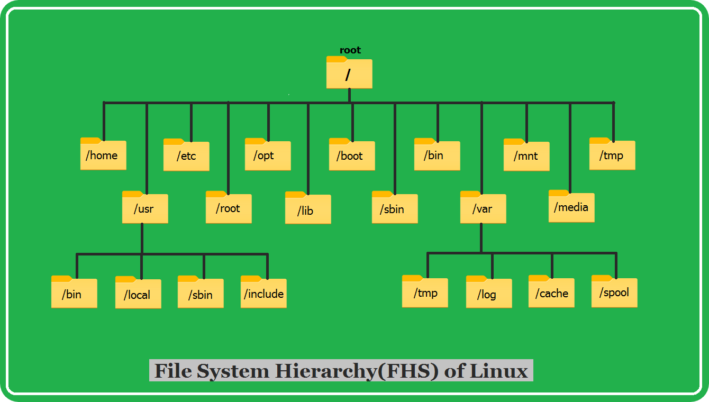

***
<br>

# inside : '/root'  
**/Root**: the main top of all files folders in the system

<table border="2" style="border-collapse:collapse; width:100%;">
  <tr>
    <th>Folder</th>
    <th>Description</th>
    <th>Example</th>
    <th>Full name</th>
  </tr>
  <tr>
    <td>/home</td>
    <td>Contains each user's personal files</td>
    <td>documents, photos</td>
    <td>___</td>
  </tr>
  <tr>
    <td>/etc</td>
    <td>Contains system configuration files</td>
    <td>network, settings</td>
    <td>Etcetera</td>
  </tr>
  <tr>
    <td>/opt</td>
    <td>A place to install additional software and non-essential applications</td>
    <td>___</td>
    <td>Optional</td>
  </tr>
  <tr>
    <td>/boot</td>
    <td>It contains boot files</td>
    <td>system kernel, and files necessary for startup</td>
    <td>___</td>
  </tr>
  <tr>
    <td>/bin</td>
    <td>Contains basic system commands</td>
    <td>ls, cp</td>
    <td>Binaries</td>
  </tr>
  <tr>
    <td>/mnt</td>
    <td>Used to mount temporary file system or external disks</td>
    <td>___</td>
    <td>Mount</td>
  </tr>
  <tr>
    <td>/tmp</td>
    <td>A temporary folder containing files that are deleted when the system restarts</td>
    <td>___</td>
    <td>Temporary</td>
  </tr>
  <tr>
    <td>/usr</td>
    <td>Contains software and user tools (non-system essential)</td>
    <td>application</td>
    <td>Unix System Resources</td>
  </tr>
  <tr>
    <td>/lib</td>
    <td>Contains the system libraries necessary to run commands</td>
    <td>___</td>
    <td>Library</td>
  </tr>
  <tr>
    <td>/sbin</td>
    <td>It contains new and varied system news</td>
    <td>reboot</td>
    <td>System Binaries</td>
  </tr>
  <tr>
    <td>/var</td>
    <td>Contains constantly changing files</td>
    <td>logs, cache files</td>
    <td>Variable</td>
  </tr>
  <tr>
    <td>/media</td>
    <td>Used to mount external media</td>
    <td>USB, CDs</td>
    <td>___</td>
  </tr>
</table>


# inside : '/usr'
<br>

<table border="2" style="border-collapse:collapse; width:100%;">
    <tr>
        <th>Folder</th>
        <th>Description</th>
        <th>Example</th>
        <th>Full name</th>
    </tr>
    <tr>
        <td>/usr/bin</td>
        <td>Contains commands for normal users</td>
        <td>___</td>
        <td>Unix System Resources / Binaries</td>
    </tr>
    <tr>
        <td>/usr/local</td>
        <td>A place to install software added manually by the user</td>
        <td>___</td>
        <td>Local Resources</td>
    </tr>
    <tr>
        <td>/usr/sbin</td>
        <td>Contains additional management commands for administrators</td>
        <td>___</td>
        <td>.../System Binaries</td>
    </tr>
    <tr>
        <td>/usr/include</td>
        <td>Contains software development files</td>
        <td>C header files</td>
        <td>___</td>
    </tr>
</table>


# inside : '/var'
<br>
<table>
    <tr>
        <th>Folder</th>
        <th>Description</th>
        <th>Example</th>
        <th>Full name</th>
    </tr>
    <tr>
        <td>/var/tmp</td>
        <td>Temporary files take longer to delete</td>
        <td>___</td>
        <td>___</td>
    </tr>
    <tr>
        <td>/var/log</td>
        <td>Contains log files record system events</td>
        <td>___</td>
        <td>___</td>
    </tr>
    <tr>
        <td>/var/cache</td>
        <td>Contains stored data to improve performance and speed of application</td>
        <td>___</td>
        <td>.../Cache Storage</td>
    </tr>
    <tr>
        <td>/var/spool</td>
        <td>Contains files waiting to be processed</td>
        <td>print files</td>
        <td>___</td>
    </tr>
</table>

<a href="https://github.com/aarab-abderrahmane/Lineux/blob/main/Remarks/Filesystem%20Hierarchy%20Standard%20(FHS)/FHS.html">⏩ GO TO THE HTML CODE</a>

**code HTML/css**
```bash
...


